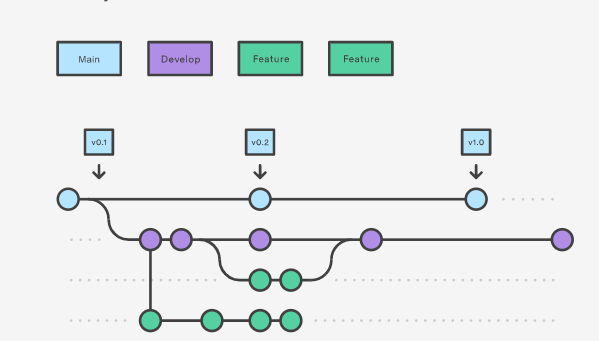

# Howdy y'all!

## This is where the 🍃 Easy Green project code lives

We will be adopting the GitFlow workflow for this project. Make sure you're familiar with [GitFlow](https://github.com/bspeelmeyer/EasyGreenApplication.git)

### The basics

#### Branching

- **develop** is our working branch
- **main** is our production branch - code is pushed to here unidirectionally from **develop** when ready for production
- create a **feature** branch for any work that you are completing. push this work to **develop** after group has reviewed and approved.

##### Overview of branching

#### TODO

- Set **develop** as default branch
- Configure **reviews** to be required before PRs are able to be merged.
- Determine repo structure - monorepo or seperate repos for backend/frontend?

